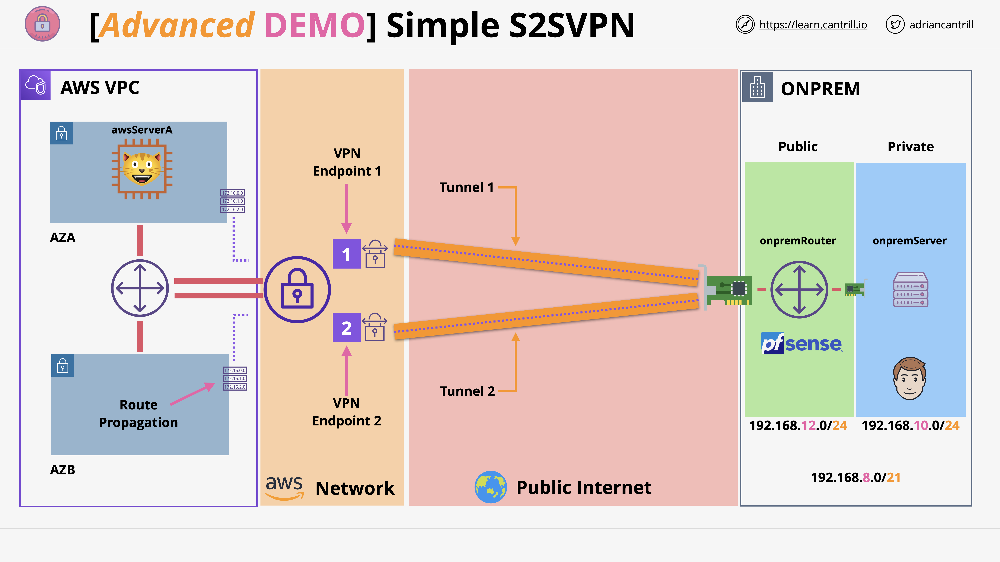
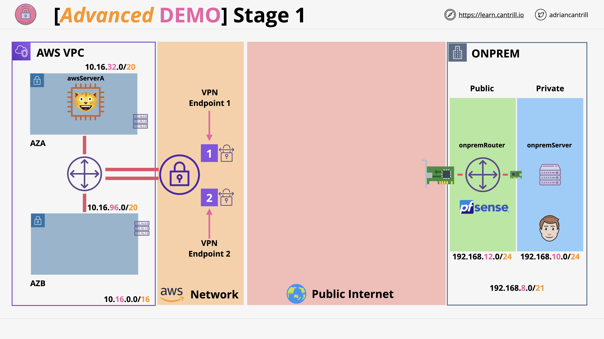
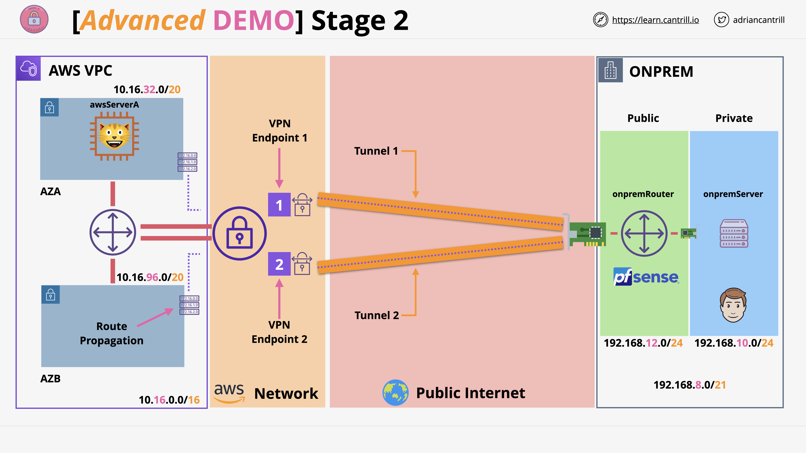
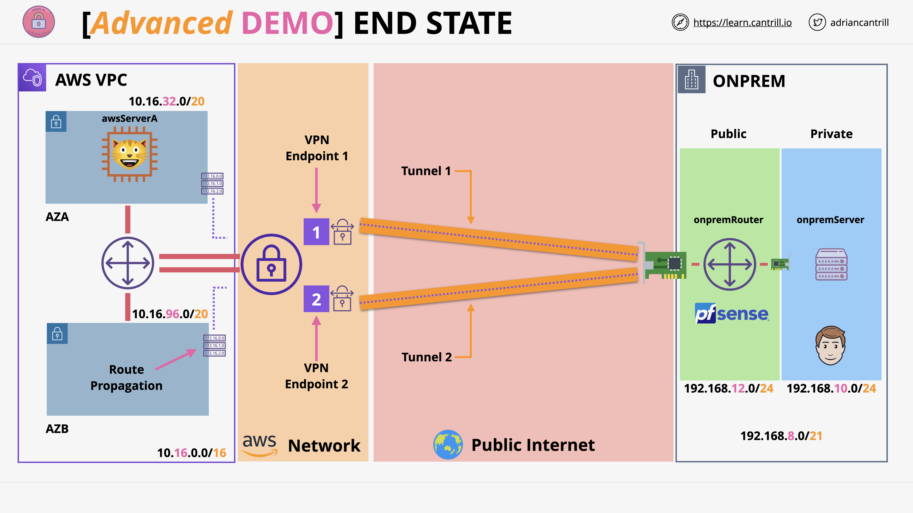

## Description
A mini project where I implement a site to site VPN between AWS and a simulated on-premises business site running the pfSense router/NAT software. I have section this project into 4 steps and is replicas of Adrian Cantrill serverless project, [Original project link](https://github.com/acantril/learn-cantrill-io-labs)

* [Pre-requisites](#pre-requisities)
* [Create Site2Site VPN](#Create-Site2Site-VPN)
* [Configure onpremises Router](#Configure-onpremises-Router)
* [Routing & Security](#Routing-&-Security)
* [Testing](#Testing)
* [Cleanup](#Cleanup)

## Pre-requisites
- [aws](https://aws.amazon.com/) - cloud platform, offers reliable, scalable, and inexpensive cloud computing services.

## Create Site2Site VPN

## Configure onpremises Router

## Routing & Security

## Testing

## Cleanup

